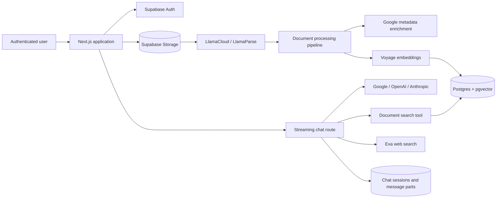

# AI Chatbot with RAG

**Chat with your own PDF documents using retrieval-augmented generation, multi-provider AI models, Supabase, and streamed responses.**


Upload private PDFs, process them into searchable embeddings, and ask questions against their contents. The application combines document retrieval with streaming chat, selectable AI providers, web search, persistent conversations, and page-level PDF citations.

> **Project status:** this repository is the recovered migration baseline for an active stabilization effort. The core product is implemented, but known build, security, data-path, and reliability issues are being addressed before production use. See [Current baseline](#current-baseline).

---

## Why this exists

General-purpose chat models are useful, but they do not automatically understand a user's private files or retain source-level traceability. This project brings the complete workflow into one application:

- authenticated private workspaces;
- direct PDF upload and parsing;
- page-aware document embeddings;
- retrieval restricted to the current user's documents;
- streamed answers with document and web-search tools;
- citations that can open the relevant PDF page;
- persistent chat sessions and message parts.

The goal is a practical foundation for a trustworthy personal research assistant—not a thin chat UI around a single model API.

## What it does

- **Supabase authentication** — sign-up, sign-in, password recovery, cookie-based sessions, and user-scoped data.
- **Private PDF management** — upload, list, process, preview, and delete documents from the `userfiles` Storage bucket.
- **Document ingestion** — parse PDFs through LlamaCloud/LlamaParse and generate page-level enriched content.
- **Vector retrieval** — create 1,024-dimension Voyage embeddings and query them through a Supabase `match_documents` RPC.
- **Multi-provider chat** — route conversations to configured Google, OpenAI, or Anthropic models through the AI SDK.
- **Tool-enabled answers** — search selected documents and retrieve current web sources through Exa.
- **Streaming persistence** — save chat sessions, messages, source parts, and tool results incrementally.
- **Citation previews** — render document references and attempt to open the cited PDF page inside the chat experience.
- **Responsive interface** — Next.js App Router UI built with Tailwind CSS, Radix primitives, and Framer Motion.

## How it works



### Document workflow

1. The browser requests a presigned upload URL.
2. The PDF is uploaded to the user's private Storage directory.
3. The server submits the file to LlamaCloud and polls the parsing job.
4. Parsed Markdown is divided into page-level content.
5. Google model calls enrich the document and page metadata.
6. Voyage creates embeddings for retrieval.
7. Document metadata and vectors are stored in Supabase.
8. During chat, the model can call `searchUserDocument` and cite matching pages.

## Tech stack

| Layer | Technology |
|---|---|
| Application | Next.js 16 App Router, React 19, TypeScript |
| UI | Tailwind CSS 4, Radix UI, Framer Motion, Lucide |
| Authentication | Supabase Auth with SSR cookies |
| Database | Supabase Postgres with Row Level Security |
| File storage | Supabase Storage |
| Vector search | pgvector and `match_documents` RPC |
| AI orchestration | Vercel AI SDK 6 |
| Chat providers | Google, OpenAI, Anthropic |
| PDF parsing | LlamaCloud / LlamaParse |
| Embeddings | Voyage AI, `voyage-3-large`, 1,024 dimensions |
| Web search | Exa |

## Quick start

### Prerequisites

- Node.js 20 or newer
- npm
- A Supabase project
- LlamaCloud and Voyage API keys for document ingestion
- At least one configured chat provider
- Exa API key if web search is enabled

### Install

```bash
git clone https://github.com/desanv01/ai-chatbot-with-rag.git
cd ai-chatbot-with-rag
npm install
cp .env.example .env.local
```

On Windows PowerShell, use:

```powershell
Copy-Item .env.example .env.local
```

Fill in `.env.local`, configure the Supabase schema, and start the development server:

```bash
npm run dev
```

Open [http://localhost:3000](http://localhost:3000).

## Environment configuration

Copy `.env.example` and provide only the services you intend to use. Never commit `.env.local` or a Supabase service-role key.

| Variable | Required for | Notes |
|---|---|---|
| `SUPABASE_URL` | Core application | Supabase project URL. |
| `SUPABASE_ANON_KEY` | Core application | Public anonymous key used with RLS. |
| `SUPABASE_SERVICE_ROLE_KEY` | Server upload pipeline | Server-only; bypasses RLS and must never reach the browser. |
| `LLAMA_CLOUD_API_KEY` | PDF parsing | LlamaCloud/LlamaParse access. |
| `VOYAGE_API_KEY` | Document retrieval | Voyage embedding access. |
| `GOOGLE_GENERATIVE_AI_API_KEY` | Google chat and current ingestion chain | Currently required by document metadata processing. |
| `OPENAI_API_KEY` | OpenAI chat models | Optional. |
| `ANTHROPIC_API_KEY` | Anthropic chat models | Optional. |
| `EXA_API_KEY` | Website search | Optional if web search is disabled. |
| `GOOGLE_FREE_TIER_ONLY` | Model policy | Set to `true` to restrict the exposed Google catalog. |
| `GOOGLE_DEFAULT_MODEL` | Google model selection | Default Google model identifier. |
| `GOOGLE_FALLBACK_MODEL` | Google fallback | Used when the preferred Google model cannot be selected. |
| `NEXT_PUBLIC_SITE_URL` | Canonical app URL | Use `http://localhost:3000` locally. |

## Supabase setup

The current schema bootstrap is located at [`database/setup.sql`](database/setup.sql). It defines the main user, chat, message-part, document, vector, RLS, Storage, and retrieval objects.

Before applying it to a new or production project:

1. Review it against the current Supabase schema.
2. Confirm the `vector` and UUID-related extensions are available.
3. Create or confirm the private `userfiles` bucket.
4. Verify Row Level Security with two separate test users.
5. Reconcile the subscription/role fields used by the application with the SQL file.

The SQL file is part of the recovered baseline and is being converted into reproducible migrations as part of the stabilization roadmap.

## Repository structure

```text
app/
├── (dashboard)/              # authenticated chat, file manager, profile, navigation
├── (frontpage)/              # landing page, authentication, documentation
├── @modal/                   # intercepted authentication modals
└── api/                      # chat, models, uploads, processing, preview proxies
components/                   # shared and UI components
database/setup.sql            # current Supabase schema bootstrap
hooks/                        # reusable React hooks
lib/                          # Supabase clients and shared services
public/                       # static assets
types/                        # application and database types
utils/                        # URL and shared utility helpers
proxy.ts                      # Supabase session refresh proxy
```

## Commands

| Command | Purpose |
|---|---|
| `npm run dev` | Start the Turbopack development server. |
| `npm run build` | Create a production Next.js build. |
| `npm run start` | Run the production server. |
| `npm run lint` | Run ESLint across JavaScript and TypeScript files. |

## Current baseline

This first public checkpoint intentionally preserves the recovered application state so future fixes have a clear starting point.

Known baseline issues include:

- TypeScript/build failure in the document-chat AI tool schema.
- ESLint configuration failure before source linting begins.
- Inconsistent document identity between uploaded Storage paths, metadata, preview, and deletion.
- Processing job IDs and privileged Storage paths need stronger server-side ownership binding.
- Public URL proxy routes require SSRF, timeout, size, content-type, and HTML-isolation controls.
- Database SQL and generated TypeScript types have drifted.
- Model catalogs and provider fallbacks are duplicated across routes.
- No unit, integration, end-to-end, or CI test suite is currently present.

These issues are documented rather than hidden because the repository is the starting point for the repair and upgrade journey.

## Roadmap

- [ ] Make type checking, linting, and production build pass.
- [ ] Introduce canonical document and ingestion-job identities.
- [ ] Harden upload, preview, processing, and URL-fetch authorization.
- [ ] Convert the database bootstrap into ordered migrations.
- [ ] Reconcile database types with the live schema.
- [ ] Centralize provider and model configuration.
- [ ] Add bounded concurrency, retries, and durable ingestion status.
- [ ] Add unit, integration, RLS, and browser regression tests.
- [ ] Add GitHub Actions quality gates.
- [ ] Audit and document the production Supabase and Vercel configuration.

## Security

- Keep all provider keys and Supabase service credentials in `.env.local` or the deployment platform's encrypted environment settings.
- Never expose `SUPABASE_SERVICE_ROLE_KEY` through a `NEXT_PUBLIC_` variable.
- Do not commit exported user documents, database dumps, or local chat history.
- Use GitHub's private security advisory flow for sensitive vulnerability reports.

See [SECURITY.md](SECURITY.md) for the disclosure policy and the current deployment warning.

## Contributing

The project is entering a structured stabilization phase. Contributions should keep changes focused, explain the user impact, and include validation appropriate to the risk. Bug reports are most useful when they include reproduction steps, expected behavior, actual behavior, and sanitized logs.

## License and attribution

Licensed under the [MIT License](LICENSE.md).

The recovered codebase originated from `ElectricCodeGuy/SupabaseAuthWithSSR`; the original MIT notice is preserved. This repository continues that work as a separate stabilization and product-development effort.

---

*A transparent baseline for building a safer, more reliable document-grounded AI assistant.*
