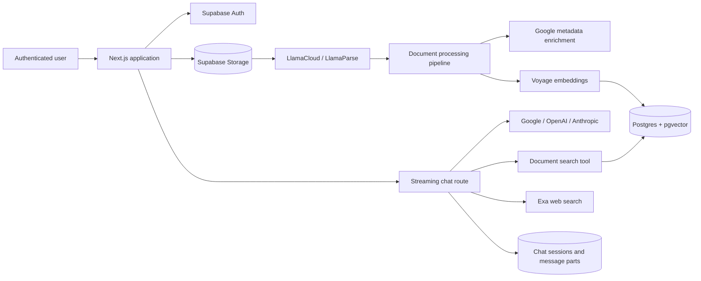

# AI Chatbot with RAG

**Chat with your own PDF documents using retrieval-augmented generation, multi-provider AI models, Supabase, and streamed responses.**


Upload private PDFs, process them into searchable embeddings, and ask questions against their contents. The application combines document retrieval with streaming chat, selectable AI providers, web search, persistent conversations, and page-level PDF citations.

> **Project status:** V1 has an implementation and offline validation checkpoint; operational acceptance remains pending Phase8. Phase0, Phase1 and Phase6 are accepted. Phase6 PR23 is merged with successful pre-merge CI; Phase7 documentation is prepared and reviewed, with merge/CI acceptance owned by main. No live migration, provider verification, or deployment is established by this checkpoint. See [Current checkpoint](#current-checkpoint) and [V1 validation](docs/V1_VALIDATION.md).

---

## Why this exists

General-purpose chat models are useful, but they do not automatically understand a user's private files or retain source-level traceability. This project brings the complete workflow into one application:

- authenticated private workspaces;
- direct PDF upload and parsing;
- page-aware document embeddings;
- retrieval restricted to the current user's documents;
- streamed answers with document and web-search tools;
- citations that can open the relevant PDF page;
- persistent chat sessions and message parts.

The goal is a practical foundation for a trustworthy personal research assistant—not a thin chat UI around a single model API.

## What it does

- **Supabase authentication** — sign-up, sign-in, password recovery, cookie-based sessions, and user-scoped data.
- **Private PDF management** — upload, list, process, preview, and delete documents from the `userfiles` Storage bucket.
- **Document ingestion** — parse PDFs through LlamaCloud/LlamaParse and generate page-level enriched content.
- **Vector retrieval** — create 1,024-dimension Voyage embeddings and query them through a Supabase `match_documents` RPC.
- **Multi-provider chat** — route conversations to configured Google, OpenAI, or Anthropic models through the AI SDK.
- **Tool-enabled answers** — search the current user's ready documents and retrieve current web sources through Exa.
- **Streaming persistence** — save chat sessions, messages, source parts, and tool results incrementally.
- **Citation previews** — render document references and attempt to open the cited PDF page inside the chat experience.
- **Responsive interface** — Next.js App Router UI built with Tailwind CSS, Radix primitives, and Framer Motion.

## How it works


```mermaid
flowchart LR
    User[Authenticated user] --> UI[Next.js application]
    UI --> Auth[Supabase Auth]
    UI --> Storage[(Supabase Storage)]
    Storage --> Parser[LlamaCloud / LlamaParse]
    Parser --> Processor[Document processing pipeline]
    Processor --> Google[Google metadata enrichment]
    Processor --> Voyage[Voyage embeddings]
    Voyage --> Vectors[(Postgres + pgvector)]
    UI --> Chat[Streaming chat route]
    Chat --> Models[Google / OpenAI / Anthropic]
    Chat --> Retrieval[Document search tool]
    Retrieval --> Vectors
    Chat --> Web[Exa web search]
    Chat --> Messages[(Chat sessions and message parts)]
```

### Document workflow

1. An authenticated upload request receives a unique canonical Storage path and signed upload URL. PDF limits are 25 MiB per file and 150 MiB total user storage; uploads do not replace existing objects.
2. The server validates ownership and the uploaded PDF before submitting it to LlamaCloud. Signed job tokens bind parsing jobs to the user and canonical Storage path.
3. Processing fetches the LlamaParse v1 JSON result and maps explicit page numbers to parser-reported page positions, preserving blank pages. Markdown separators do not define pages; physical PDF alignment remains pending Phase8 validation.
4. A unique document reservation prevents repeated or conflicting processing from replacing existing documents. The document remains `processing` during Google metadata enrichment and Voyage indexing.
5. Embeddings must contain 1,024 finite values. Privileged finalization checks the expected nonblank page set before marking the document `ready`; failures best-effort mark it `failed`. Retrieval excludes unfinished documents.
6. During chat, `searchUserDocument` retrieves user-owned ready pages with a total 40,000-character document context bound and page citations. Live physical citation alignment still requires Phase8 validation.
7. Incremental chat persistence uses stable identities for messages and parts and makes save failures observable. Reload behavior and live failure paths remain Phase8 checks.

Processing is bounded within the request, with no durable background worker, automatic resume, or automatic model retries. Interrupted requests may leave an unsearchable `processing` document. See [Document processing state](docs/V1_PROCESSING.md) before deliberately deleting and re-uploading an unfinished document.

## Tech stack

| Layer | Technology |
|---|---|
| Application | Next.js 16 App Router, React 19, TypeScript |
| UI | Tailwind CSS 4, Radix UI, Framer Motion, Lucide |
| Authentication | Supabase Auth with SSR cookies |
| Database | Supabase Postgres with Row Level Security |
| File storage | Supabase Storage |
| Vector search | pgvector and `match_documents` RPC |
| AI orchestration | Vercel AI SDK 6 |
| Chat providers | Google, OpenAI, Anthropic |
| PDF parsing | LlamaCloud / LlamaParse |
| Embeddings | Voyage AI, `voyage-3-large`, 1,024 dimensions |
| Web search | Exa |

## Quick start

See the [V1 local runtime guide](docs/v1-local-runtime.md) for configuration preservation, commands, and historical local receipts. The [validation checklist](docs/V1_VALIDATION.md) separates offline evidence from pending live acceptance. Live credentials are deferred to Phase8; they are not needed to review this code checkpoint.

### Prerequisites

- Node.js 24 LTS
- npm 11
- A Supabase project
- Google, LlamaCloud and Voyage API keys for document ingestion when Phase8 begins
- A dedicated document job signing secret when Phase8 begins
- At least one configured chat provider
- Exa API key if web search is enabled

### Install

```bash
git clone https://github.com/desanv01/ai-chatbot-with-rag.git
cd ai-chatbot-with-rag
npm ci
if [ ! -e .env.local ]; then cp .env.example .env.local; fi
```

On Windows PowerShell, use:

```powershell
if (-not (Test-Path -LiteralPath .env.local)) {
    Copy-Item .env.example .env.local
}
```

For local startup, preserve configuration and start the development server. Before live application use, complete the reviewed migration prerequisites and authorized Phase8 configuration and checks below:

```bash
npm run dev
```

Open [http://localhost:3000](http://localhost:3000).

## Environment configuration

Preserve an existing `.env.local`; copy `.env.example` only if `.env.local` is absent, and provide only the services you intend to use. Never commit `.env.local` or a Supabase service-role key.

| Variable | Required for | Notes |
|---|---|---|
| `SUPABASE_URL` | Core application | Supabase project URL. |
| `SUPABASE_ANON_KEY` | Core application | Public anonymous key used with RLS. |
| `SUPABASE_SERVICE_ROLE_KEY` | Server upload pipeline | Server-only; bypasses RLS and must never reach the browser. |
| `DOCUMENT_JOB_SECRET` | Document job signing | Configure a dedicated server-only secret in Phase8. The current code has a service-role fallback; use a separate secret for live validation. |
| `LLAMA_CLOUD_API_KEY` | PDF parsing | LlamaCloud/LlamaParse access. |
| `VOYAGE_API_KEY` | Document retrieval | Voyage embedding access. |
| `GOOGLE_GENERATIVE_AI_API_KEY` | Google chat and current ingestion chain | Currently required by document metadata processing. |
| `OPENAI_API_KEY` | OpenAI chat models | Optional. |
| `ANTHROPIC_API_KEY` | Anthropic chat models | Optional. |
| `EXA_API_KEY` | Website search | Optional if web search is disabled. |
| `GOOGLE_FREE_TIER_ONLY` | Model policy | Set to `true` to restrict the exposed Google catalog. |
| `GOOGLE_DEFAULT_MODEL` | Google model selection | Default Google model identifier. |
| `GOOGLE_FALLBACK_MODEL` | Google fallback | Used when the preferred Google model cannot be selected. |
| `NEXT_PUBLIC_SITE_URL` | Canonical app URL | Use `http://localhost:3000` locally. |

## Supabase setup

The authoritative application schema sources are the ordered files in [`supabase/migrations`](supabase/migrations):

1. `20260819050131_remote_schema.sql`
2. `20260819050430_reconcile_live_application_schema.sql`
3. `20261006232436_v1_document_processing_state.sql`

[`database/setup.sql`](database/setup.sql) is historical reference, not the current setup recipe. Review the ordered migrations against the target schema and migration history, including extensions, grants, RLS, private `userfiles` Storage policies, and application types.

For an existing backend with valuable data, inspect and back up its schema and data before review and separately authorized migration application. Never reset it, automatically delete or deduplicate rows, or reindex legacy documents. Duplicate legacy Storage paths require manual review; the processing-state migration fails transactionally on those conflicts.

The processing-state migration has not been applied live at this checkpoint. Current code requires it before live use. Reviewed application migrations are a Phase8 prerequisite; setting credentials alone does not satisfy that prerequisite. Verify schema, grants, ownership, and Storage access using two accounts after an explicitly authorized application. See [V1 validation](docs/V1_VALIDATION.md).

## Repository structure

```text
app/
├── (dashboard)/              # authenticated chat, file manager, profile, navigation
├── (frontpage)/              # landing page, authentication, documentation
├── @modal/                   # intercepted authentication modals
└── api/                      # chat, models, uploads, processing, preview proxies
components/                   # shared and UI components
database/setup.sql            # historical schema reference
supabase/migrations/          # authoritative ordered application migrations
hooks/                        # reusable React hooks
lib/                          # Supabase clients and shared services
public/                       # static assets
types/                        # application and database types
utils/                        # URL and shared utility helpers
proxy.ts                      # Supabase session refresh proxy
```

## Commands

| Command | Purpose |
|---|---|
| `npm run dev` | Start the Turbopack development server. |
| `npm run build` | Create a production Next.js build. |
| `npm run start` | Run the production server. |
| `npm run lint` | Run ESLint across JavaScript and TypeScript files. |
| `npm run typecheck` | Check TypeScript without emitting files. |
| `npm run test:offline` | Run all eight offline source/mock regression suites; script and CI step accepted in merged [PR23](https://github.com/desanv01/ai-chatbot-with-rag/pull/23). |

## Current checkpoint

The original lint and type/build failures are repaired. Phase1 local lint, type checking, production build, and startup receipts are recorded in the [runtime guide](docs/v1-local-runtime.md). CI runs all eight offline suites, lint, type checking, and a build with non-secret placeholders; that build fixture establishes compilation only and must not be deployed.

The current implementation includes provider/model credential gating, signed canonical document jobs and paths, bounded PDF uploads, unique processing reservations, protected `processing`/`ready`/`failed` readiness, explicit JSON page mapping preserving blanks, finite 1,024-dimension embedding validation, bounded retrieval, and stable incremental persistence with observable save failures. Missing optional OpenAI, Anthropic, or Exa credentials gate the corresponding features; Google remains required for the current ingestion chain.

The main review accepted merged [Phase6 PR23](https://github.com/desanv01/ai-chatbot-with-rag/pull/23): all eight offline source/mock suites, whole-repository lint and type checking passed locally, and pre-merge CI passed offline suites, lint, types and build in [run37548484315](https://github.com/desanv01/ai-chatbot-with-rag/actions/runs/37548484315) and [run37548488577](https://github.com/desanv01/ai-chatbot-with-rag/actions/runs/37548488577). Synthetic SQL grants, ownership, completion, and rollback checks also passed locally. Post-merge main CI [run37548674013](https://github.com/desanv01/ai-chatbot-with-rag/actions/runs/37548674013) is verified SUCCESS at merge commit `28c0eccc1cd63dbda2fad72526f4662cb1f5cc0d`. These results do not establish live Auth, RLS, Storage, parser compatibility, provider health, grounding, or persistence. The deprecated LlamaParse v1 endpoint and legacy page provenance remain unverified. There is no resumable background ingestion job.

See [V1 validation](docs/V1_VALIDATION.md) for accepted PR evidence and the complete Phase8 gate. V1 operational acceptance remains pending.

## Roadmap

- [x] Accept Phase0 baseline and Phase1 local runtime repair.
- [x] Implement provider gating, canonical document/job authorization, processing state, retrieval bounds, and persistence repairs.
- [x] Add ordered migration sources and CI lint/type/build gates.
- [x] Document the checkpoint, evidence boundaries and Phase8 plan.
- [x] Accept Phase6 offline suites and CI integration in merged PR23.
- [ ] Complete main-owned Phase7 merge and CI acceptance.
- [ ] Review and explicitly authorize Phase8 migration application and billable provider checks.
- [ ] Complete two-account live security, ingestion, grounding, persistence, and full end-to-end validation.
- [ ] Review release evidence and explicitly authorize any deployment separately.

## Security

- Keep all provider keys and Supabase service credentials in `.env.local` or the deployment platform's encrypted environment settings.
- Never expose `SUPABASE_SERVICE_ROLE_KEY` through a `NEXT_PUBLIC_` variable.
- Do not commit exported user documents, database dumps, or local chat history.
- Use GitHub's private security advisory flow for sensitive vulnerability reports.

See [SECURITY.md](SECURITY.md) for the disclosure policy and the current deployment warning.

## Contributing

The project is entering a structured stabilization phase. Contributions should keep changes focused, explain the user impact, and include validation appropriate to the risk. Bug reports are most useful when they include reproduction steps, expected behavior, actual behavior, and sanitized logs.

## License and attribution

Licensed under the [MIT License](LICENSE.md).

The recovered codebase originated from `ElectricCodeGuy/SupabaseAuthWithSSR`; the original MIT notice is preserved. This repository continues that work as a separate stabilization and product-development effort.

---

*A transparent baseline for building a safer, more reliable document-grounded AI assistant.*
